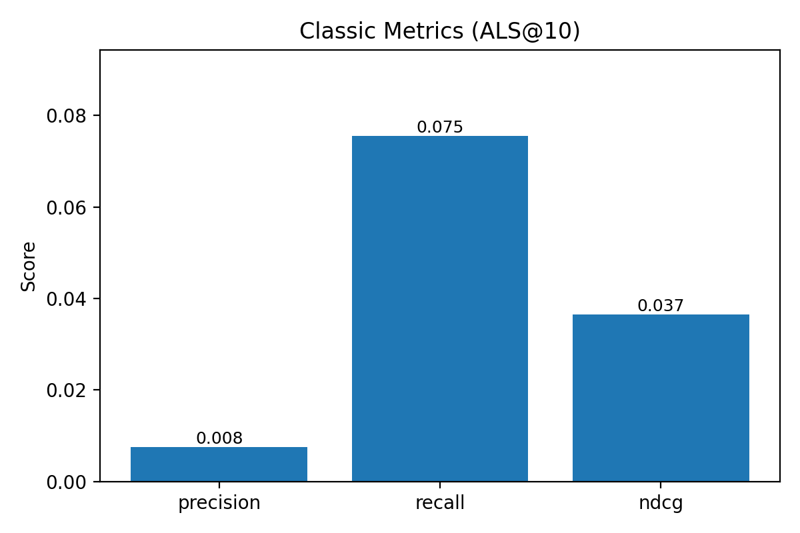
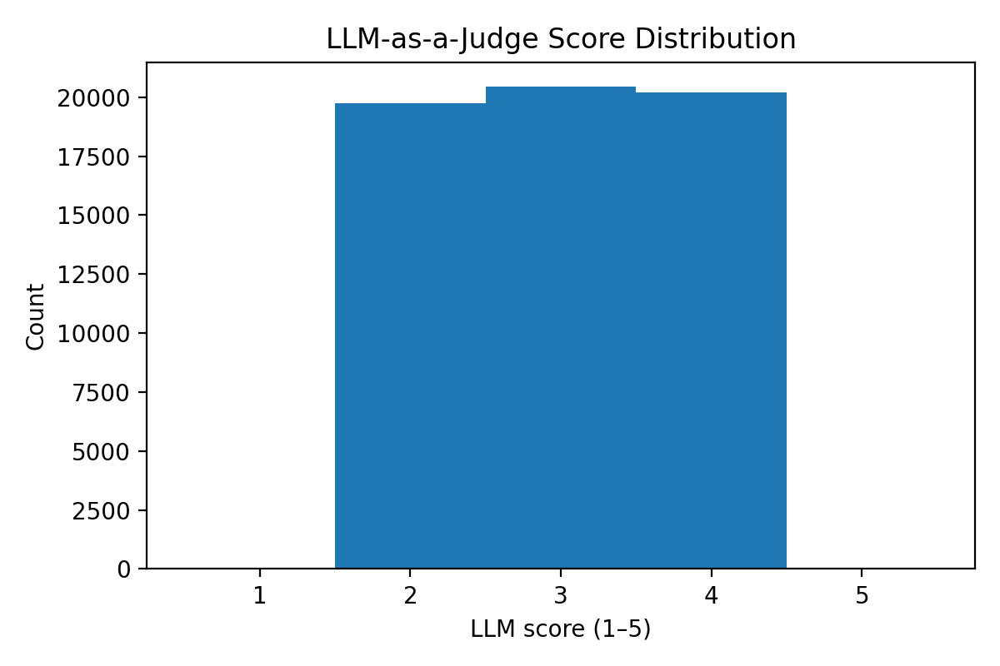
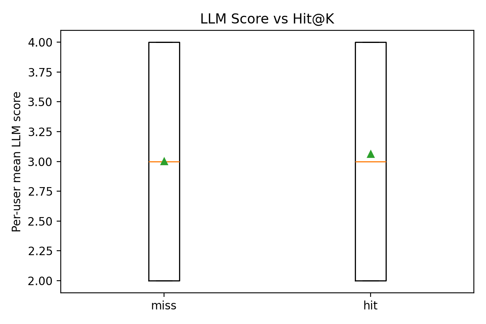
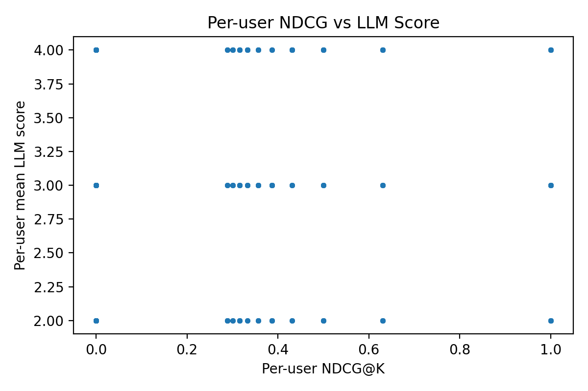

# JudgeBench — Weekend MVP

This is a weekend project exploring how to evaluate recommender systems with both **classic offline metrics** and **LLM-as-a-judge** techniques.

---

## 🚀 Project Overview

- Dataset: MovieLens (1M)
- Baselines:
  - **item-kNN** — weak baseline, Recall@10 ≈ 0.05
  - **ALS (implicit matrix factorization)** — stronger baseline, Recall@10 ≈ 0.075
- Judge: **Gemini** (LLM-based evaluator)
- Goal: Compare **classic metrics** (precision, recall, NDCG) vs **LLM judgments** and check their correlation.

---

## 📊 Results

### Classic Metrics (ALS@10)
- **Precision@10:** 0.0075  
- **Recall@10:** 0.0755  
- **NDCG@10:** 0.0365  

This is ~50% improvement over the kNN baseline (Recall@10 ≈ 0.051).

### LLM-as-a-Judge
- Score distribution: balanced across **2 / 3 / 4**  
- No strong correlation with classic metrics  
  - Spearman (LLM vs NDCG): ρ ≈ 0.02 (p ≈ 0.13)  
  - Point-biserial (LLM vs hit@10): r ≈ 0.02 (p ≈ 0.13)

### Takeaways
- Better offline metrics (ALS vs kNN) **do not guarantee higher LLM-judge scores**.
- LLMs measure different qualities (list coherence, diversity, flow) than precision/recall.
- **Blended evaluation is needed**:
  - Offline metrics for retrieval accuracy  
  - LLM judges for qualitative aspects  
  - Human calibration sets  
  - Internal **dogfooding** (real users on the team trying the recs)

---

## 📷 Key Plots

### Classic Metrics (ALS@10)


### LLM Judge Score Distribution


### LLM Score vs Hit@10


### Per-user NDCG vs LLM Score


---

## ⚡ How to Run

### 1. Train baseline (ALS)
```bash
python models/als_numpy.py --train data/processed/train.csv --out results/preds_als_top10.csv --topk 10
```

### 2. Compute classic metrics
```bash
python eval/classic.py --preds results/preds_als_top10.csv --truth data/processed/test.csv --out results/classic_metrics.json --k 10
```

### 3. Score with Gemini
```bash
# Set your Gemini API key in env first:
# $env:GEMINI_API_KEY="sk-xxxx"

python eval/llm_judge.py --mode gemini --preds results/preds_als_top10.csv --out results/llm_scores.csv --rpm 8 --resume
```

### 4. Agreement analysis
```bash
python eval/agreement.py --classic results/classic_metrics.json --llm results/llm_scores.csv --preds results/preds_als_top10.csv --truth data/processed/test.csv --out results/agreement.json --k 10
```

### 5. Generate plots
```bash
python reports/make_plots.py --preds results/preds_als_top10.csv --truth data/processed/test.csv --llm results/llm_scores.csv --classic results/classic_metrics.json --k 10 --label ALS@10 --out_dir results
```

### 6. Launch dashboard
```bash
streamlit run app/streamlit_app.py
```

---

## 📝 Next Steps
- Add more baselines (Popularity, BERT4Rec, etc.)
- Try other judges (Claude, OpenAI, Mixtral)
- Add a comparison dashboard (kNN vs ALS side-by-side)
- Explore **human calibration + internal dogfooding** as part of the loop

---

## 📜 License
MIT
